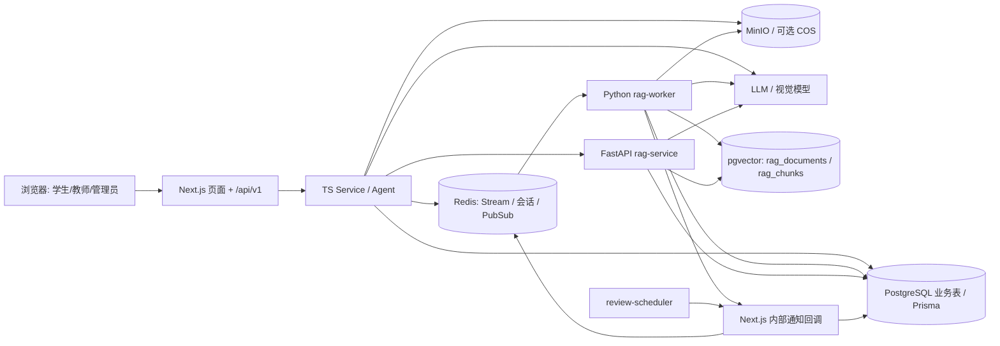
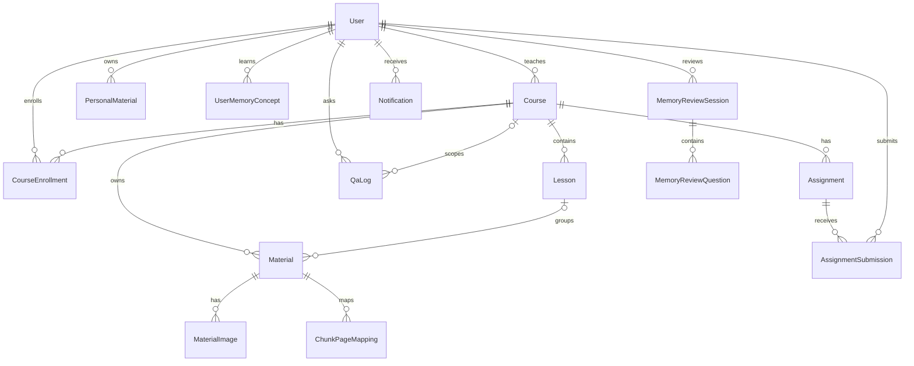
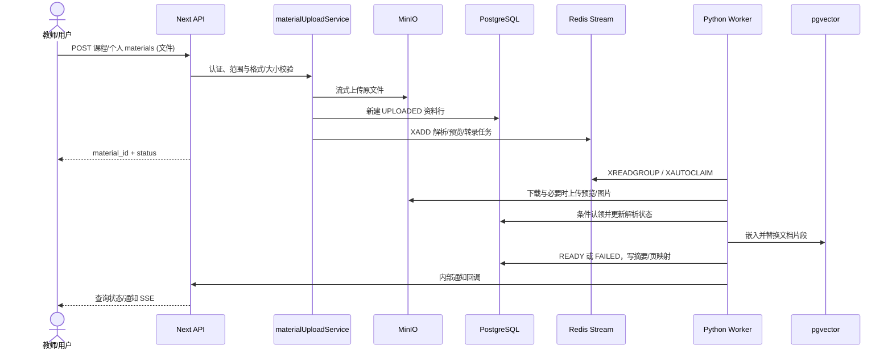
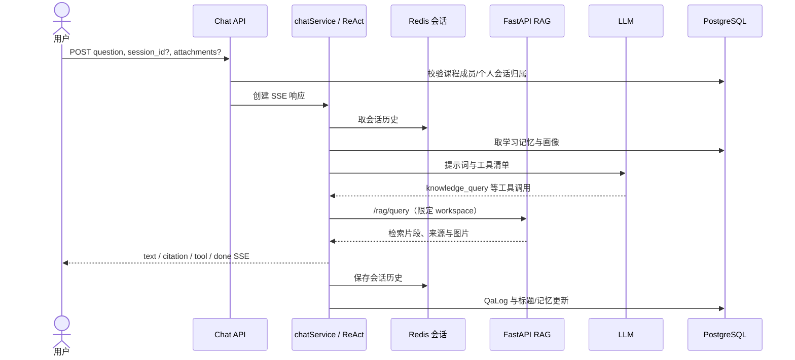

# 项目技术文档（开发后回填的开发前 PRD）

> 本文档以 2026-09-14 的仓库代码为事实基线，采用 PRD 的需求与验收视角回写现状。它不是历史立项文档；原始立项背景、真实用户规模、上线环境和业务指标**无法从当前项目确认**。文中“已实现”指代码中存在相应路径，不代表生产环境已部署或经性能验证；“建议目标”不是实测结果。事实依据仅为源码、配置、Schema、迁移和测试。仓库根目录及 `edu-platform/` 未发现 README，因此无可核对的 README 冲突；`tests/eval/` 的 README 未用于推断系统能力。

## 1. 项目概述

| 项目 | 基于实现可确认的范围 |
| --- | --- |
| 背景 | 教师可管理课程、课节和教学资料；学生可选课、问答、提交作业及复习。原始业务动机、组织和商业场景无法从当前项目确认。依据：`edu-platform/app/(app)/`、`edu-platform/prisma/schema.prisma`。 |
| 目标 | 将课程资料与个人资料转为可检索知识，支持教学问答、作业生成/批改、学习记录和复习。依据：`edu-platform/lib/services/`、`src/rag_mvp/`。 |
| 目标用户 | `STUDENT`、`TEACHER`、`ADMIN` 三种角色；具体学校、年龄段和规模无法从当前项目确认。依据：`edu-platform/prisma/schema.prisma` 的 `UserRole`。 |
| 核心场景 | 教师建课并上传资料；学生通过分享码入课后阅读与提问；教师生成、编辑并发布作业，学生提交，系统初评，教师复核返还；用户管理个人知识库与记忆复习。 |
| 主要问题 | 将原始教学文件变为可引用的问答上下文，并串联授课、练习、反馈。教学效果是否已改善，无法从当前项目确认。 |

## 2. 需求分析

### 2.1 功能需求：已实现范围

下表的“异常”仅列代码中可见的主要失败分支；所有受保护的 API 还可能返回认证失败或资源不可访问。

| 业务模块（依据） | 目标与主要用户 | 输入 → 核心处理 → 输出 | 主要异常 |
| --- | --- | --- | --- |
| 账号与管理（`lib/services/authService.ts`、`courseService.ts`、`userService.ts`，`app/api/v1/admin/`） | 管理员管理用户、查看课程并管理 Agent 风格/技能来源；用户登录与维护资料 | 用户名/密码经 Argon2 校验，签发 JWT 与轮换刷新令牌；管理员创建/停用用户；输出用户、令牌或管理列表 | 无效凭证、禁用账号、角色不符、刷新令牌过期/已使用 |
| 课程与课节（`lib/services/courseService.ts`、`lib/course-access.ts`） | 教师组织课程，学生选课 | 课程/课节内容、分享码；教师创建/编辑/软删/排序，学生按码加入；输出课程、课节、选课结果 | 无效 UUID、非课程所有者、重复选课或不存在的课程 |
| 课程资料与个人知识库（`lib/services/materialUploadService.ts`、`materialService.ts`、`personalMaterialService.ts`；`src/rag_mvp/material_processor.py`） | 教师上传课程文件；个人用户上传私有文件 | PDF/TXT/MD/Office/音视频流 → MinIO → 业务表 → Redis Stream → 转换/解析/转录/嵌入 → pgvector；输出状态、预览、原件、摘要和可检索片段 | 格式/大小不符、存储或队列不可用、解析/转码/索引失败；支持取消、重试与部分预览修复 |
| AI 问答与会话（`lib/services/chatService.ts`、`lib/agent/`、`src/rag_service/main.py`） | 课程成员、问答中心用户、个人知识库用户 | 问题、会话和附件 → Redis 历史与 PostgreSQL 记忆 → ReAct 工具 → RAG/LLM → SSE 文本、工具事件和引用；`QaLog` 与线程标题持久化 | 会话越权、无可用资料、模型/检索失败、流中断、工具参数或审批失败 |
| 作业（`lib/services/assignmentService.ts`、`src/rag_mvp/assignment_gen.py`） | 教师生成、编辑、发布题目，学生查看 | 教师自然语言要求/结构参数 → Redis 任务 → 候选知识检索、规划、出题、评审/修复 → 草稿；教师可改题、重生成、补全并发布；输出题目与质量/采纳信息 | 空要求、无资料/生成失败、非草稿修改、并发发布冲突 |
| 提交与批改（`lib/services/submissionService.ts`、`lib/services/grading/grading-strategies.ts`） | 学生作答，教师复核 | 答案 → 唯一提交记录 → 客观题自动比对、主观题 LLM 评分 → 教师改分/返还；输出分数、反馈及状态 | 过期/未发布作业、重复并发提交、旧批改覆盖、评分服务失败；主观题失败可给参考分并提示复核 |
| 学习记忆与每日复习（`lib/agent/memory/`、`lib/services/memoryReviewService.ts`、`scripts/review-scheduler.ts`） | 用户沉淀知识点并复习 | 会话事实/概念 → 用户画像和掌握度；定时调度按用户本地时间生成题组 → 答题即时判分并更新掌握度；输出待复习题和结果 | 无概念/无题、模型失败、过期或重复答题、关闭会话；无答题不更新掌握度 |
| 通知与分析（`lib/services/notificationService.ts`、`analyticsService.ts`） | 用户接收事件；教师查看课程/作业分析 | 材料/作业/评分事件写 PostgreSQL，Redis Pub/Sub 推送 SSE；问答及作业记录聚合为统计 | Pub/Sub 失败时数据库通知仍可查询；统计依赖已写入的数据；课程分析的 `weak_concepts` 当前固定为空数组 |

**主要 Use Case**：教师创建课程和课节 → 上传资料并等待 `READY` → 分享码让学生选课 → 学生阅读资料并提问 → 教师按资料生成并发布作业 → 学生提交 → 系统初评 → 教师复核返还 → 学生查看分数和反馈，并在个人知识库、问答中心或每日复习中继续学习。上述链路由多个模块组合而成，跨模块端到端成功率无法从当前项目确认。

### 2.2 非功能需求：面向中小型项目的建议目标

以下均为**建议验收目标**，不表示当前实现已达到；仓库的测试或评估数据未用作目标依据。

| 维度 | 建议目标及当前实现线索 |
| --- | --- |
| 性能 | 普通列表/详情接口在典型班级规模下保持可交互响应；上传、解析、转录、生成和批改异步化并显示进度。现有 Redis Stream、分页/索引与 SSE 提供基础，但无可确认的生产延迟基线。 |
| 可用性 | 依赖故障应给明确状态与重试入口；资料队列失败可标 `FAILED`，通知以 DB 为准。建议为 PostgreSQL、Redis、对象存储、LLM/RAG 设置健康检查、告警与恢复演练。 |
| 可靠性 | 任务重投后不重复污染索引或生成结果；Worker 可认领遗留消息、资料可检测陈旧状态。建议补齐失败任务持久化重试/死信和跨存储补偿。 |
| 安全性 | 所有用户读写必须按角色、课程成员关系或资源所有权校验；内部 API 默认拒绝未配置密钥；危险工具有明确审批与隔离。现状差距见第 9 节。 |
| 可扩展性 | 以课程/用户 workspace 隔离向量数据，Web 与 Worker 可独立扩容；当资料增长时分离计算密集型解析与在线问答。 |
| 可维护性 | API、Service、DTO、Agent、RAG Worker 分层；保持 TS/Python 任务契约同步，所有状态变化有回归测试；构建时不跳过类型和 lint 检查。 |
| 并发能力 | 同一提交/发布/资料索引在并发请求下应只有一个有效结果；现有唯一键、条件更新和 `gradingToken`/`version` 为基础。建议按实际负载压测后确定 Worker 数量。 |
| 数据一致性 | PostgreSQL 为业务状态源，MinIO 和向量表是派生/外部存储；推荐以幂等任务和对账修复跨系统部分成功，避免把 Redis Pub/Sub 当持久队列。 |

## 3. 系统架构

**实际形态**：Next.js App Router 同时提供 React 前端和 Route Handlers；Prisma 管业务 PostgreSQL。TypeScript Agent 位于 Web 服务内。FastAPI RAG 服务提供检索/生成等内部 HTTP 接口；独立 Python Worker 消费 Redis Stream。RAG 向量表由 Python `vector_store.ensure_schema()` 管理，可经 `RAG_PG_DSN` 指向另一 PostgreSQL 数据库。Redis 还保存 24 小时对话历史、短期审批记录与通知 Pub/Sub。文件进 MinIO；附件图片在配置完整时可进腾讯 COS。LLM/Embedding 可使用 OpenAI 兼容端点或 Ollama；解析可用 MinerU 本地/云端，音视频转录依赖 ffmpeg/faster-whisper。依据：`edu-platform/docker-compose.yml`、`lib/agent/llm-registry.ts`、`src/rag_mvp/config.py`、`document_parser.py`、`video_transcribe.py`。



`docker-compose.yml` 还定义 `cloudflared` Tunnel；仓库中有 `grafana/` 和 `loki-config.yaml`，但 Compose 中未定义 Grafana/Loki 服务。`instrumentation-node.ts` 目前只处理 Windows 控制台编码，不能据此推断已接入服务端指标；生产可观测链路无法从当前项目确认。Compose 的 PostgreSQL 服务挂载 `./postgres/init.sql`，仓库中该文件不存在；默认 RAG DSN 指向 `edu_rag`，但未找到创建该数据库的代码或挂载 SQL，因此直接以默认 Compose 启动时，该向量库初始化路径无法确认。

## 4. 核心模块设计

| 模块 | 职责、核心文件与对外接口 | 依赖、流程及关键决策 |
| --- | --- | --- |
| 页面/API 边界 | `edu-platform/app/(app)/`、`app/(auth)/`、`app/api/v1/**/route.ts`；REST + SSE | Route Handler 取认证上下文、校验请求并委托 `lib/services/`；`lib/http/` 统一错误体；页面组件在 `components/`。 |
| 身份/课程权限 | `lib/services/authService.ts`、`lib/jwt.ts`、`lib/course-access.ts`；登录/刷新/课程相关 API | Argon2、JWT、数据库刷新令牌；课程写入限定教师所有者，课程读取限定教师或已选学生。 |
| 资料管理 | `lib/services/materialUploadService.ts`、`materialService.ts`、`personalMaterialService.ts`、`lib/material-ingestion.ts`；课程/个人资料 API | 共用流式上传与格式白名单，课程/个人分表、分 MinIO 路径；先存对象再建行并入队，队列失败标记 `FAILED`；状态机及独立 Office PDF 预览状态。 |
| 异步处理/RAG | `lib/queue/ragTask.ts`、`src/rag_mvp/worker.py`、`task_handlers.py`、`material_processor.py`、`document_parser.py`、`engine.py`、`vector_store.py`；Redis Stream 与 FastAPI | Worker `XREADGROUP/XAUTOCLAIM/XACK`；Office 转 PDF、文档解析、媒体转录、切块嵌入、替换向量；按课程/用户 workspace 隔离；向量与全文检索融合，引用映射到资料页。 |
| Agent/问答 | `lib/services/chatService.ts`、`lib/agent/react-loop.ts`、`tool-executor.ts`、`tools/`、`session-store.ts`；课程/问答中心/个人库 SSE | 历史/记忆参与提示词，ReAct 调用白名单工具；工具 JSON Schema 校验和执行时权限钩子；SSE 事件与 `QaLog` 记录。会话正文在 Redis，业务会话索引和问答日志在 PG。 |
| 作业/评分 | `lib/services/assignmentService.ts`、`submissionService.ts`、`lib/domain/*-lifecycle.ts`、`grading/grading-strategies.ts`、`src/rag_mvp/assignment_gen.py`；作业与提交 API | 生成异步、教师审稿发布；草稿/发布状态条件更新，提交唯一键与乐观并发版本，主客观题策略分流。 |
| 记忆/通知/分析 | `lib/agent/memory/`、`lib/services/memoryReviewService.ts`、`notificationService.ts`、`analyticsService.ts`；个人复习、通知及统计 API | 用户画像/事实/概念持久化；定时复习生成与答题；通知 DB 持久化后 Pub/Sub 实时推送；课程问答及作业聚合。 |

## 5. 数据设计

业务数据由 `edu-platform/prisma/schema.prisma` 及 `prisma/migrations/` 定义；RAG 数据表由 `src/rag_mvp/vector_store.py` 在运行时创建。核心实体如下。

| 实体组 | 主要字段与关系 | 约束/索引 |
| --- | --- | --- |
| 用户/课程 | `User(id, username, passwordHash, role, isActive)`；`Course(teacherId, shareCode, status, isDeleted)`；`Lesson(courseId, orderIndex)`；`CourseEnrollment(courseId, studentId)` | 用户名、分享码唯一；选课 `(courseId,studentId)` 唯一；课程/课节按教师或课程建索引。当前 `CourseStatus` 只有 `PUBLISHED`。 |
| 资料 | `Material(courseId, lessonId?, minioPath, status, previewPdfStatus, indexedChunkCount, *Summary)`；`PersonalMaterial(userId, …)`；`MaterialImage`、`ChunkPageMapping` | `(courseId,status)`、`(userId,status)` 索引；`(materialId,chunkId)` 唯一；删除/课节失效规则见 Schema。 |
| 会话/问答 | `CourseChatSession`、`QaCenterSession`、`PersonalKbSession` 存 Agent Session ID；`ChatThreadTitleOverride`；`QaLog(question, answer, tokens, hitChunks, toolCalls, citations, timelineJson)` | Agent Session ID 唯一；`QaLog` 按课程/用户+时间、会话索引；会话正文在 Redis，非 Prisma 表。 |
| 作业/提交 | `Assignment(status, teacherRequest, structuredParams, blueprint, questions, generatedQuestionsSnapshot, adoptionMetrics, qualityReport, deadline)`；`AssignmentSubmission(answers, status, gradingToken, version, gradingResult, totalScore, maxScore)` | 作业按课程+状态/时间索引；同一学生同一作业唯一；`gradingToken` 和版本用于并发保护，见 `20260809120000_concurrency_guards`。 |
| 记忆/通知 | `UserLearningProfile`、`UserMemoryFact`、`UserMemoryConcept`；`UserMemoryReviewPreference`、`MemoryReviewSession`、`MemoryReviewQuestion`；`Notification`、`AgentStyle`、`RefreshToken` | 概念 `(userId,name)` 唯一；每日复习 `(userId,scheduledDate)` 唯一；通知 `(userId,dedupKey)` 唯一；刷新令牌仅存哈希。 |
| RAG 向量 | `rag_documents(workspace,id,metadata,chunks_count)`、`rag_chunks(workspace,id,document_id,content,embedding,page_idx,metadata)`、`rag_store_metadata(embedding_dim)` | 复合主键 `(workspace,id)`，Chunk 复合外键指向 Document；HNSW cosine、全文 GIN 与文档索引；维度变化触发错误而非静默改表。 |



跨库一致性采用“业务行是状态源、对象与索引是派生结果”的实现方式；资料上传的对象/DB/Stream 不是单事务，失败靠清理对象、标记失败、重试/对账处理。Worker 认领旧任务并在部分路径用条件更新防重复。`QaLog` 与 Redis 会话、通知 DB 与 Pub/Sub 也不是原子提交。`MemoryReviewQuestion.courseId/conceptId` 是 UUID 字段，但 Schema 未声明到 `Course`/`UserMemoryConcept` 的外键关系。

## 6. 核心业务流程

### 6.1 资料上传与可检索化



依据：`app/api/v1/courses/[courseId]/materials/route.ts`、`app/api/v1/me/materials/route.ts`、`lib/material-ingestion.contract.json`、`src/rag_mvp/task_handlers.py`。Office 文件的预览 PDF 与索引状态独立；取消、索引重试和预览修复是单独操作。

### 6.2 课程/个人问答



依据：`lib/services/chatService.ts`、`lib/agent/react-loop.ts`、`lib/agent/tools/rag.ts`、`src/rag_service/main.py`。课程对话有单课程范围，问答中心可检索已选课程，个人知识库按用户隔离。回答质量及引用准确率无法从当前项目确认。

### 6.3 作业与批改

```mermaid
flowchart LR
    T[教师 POST assignments] --> G[Assignment GENERATING]
    G --> Q[Redis Stream assignment.generate]
    Q --> W[Worker 检索/规划/出题/评审]
    W --> D[DRAFT 或 FAILED]
    D --> E[教师编辑/重生成/补全]
    E --> P[PUBLISHED]
    P --> S[学生 POST submissions]
    S --> A[SUBMITTED → GRADING]
    A --> B[客观题自动 / 主观题 LLM]
    B --> C[GRADED]
    C --> R[教师改分/返还 RETURNED]
```



依据：`lib/services/assignmentService.ts`、`submissionService.ts`、`lib/domain/`、`src/rag_mvp/assignment_gen.py`。首次提交有唯一键保护；再次提交通过版本条件更新并清空旧 `gradingToken`，旧评分器不能覆盖新答案；返还后不再允许重交。

## 7. API 与外部接口

下表路径统一以 `/api/v1` 为前缀；`C=/courses/{courseId}`，`A=C/assignments/{assignmentId}`，`S=A/submissions/{submissionId}`，`M=/materials/{materialId}`，`PM=/me/materials/{materialId}`。常规 JSON 响应见 `lib/http/json-response.ts`，文件与 SSE 例外。输入/输出为主要字段或资源，不是完整 OpenAPI Schema；详细字段见 `lib/dto/` 与相应 `route.ts`。

| Endpoint | Method | 功能；主要输入 → 输出 | 权限 |
| --- | --- | --- | --- |
| `/login`, `/refresh`, `/logout` | POST | 凭证/刷新令牌 → JWT、刷新令牌、用户；退出清 Cookie | 登录公开；刷新须有效令牌；退出无独立权限 |
| `/me/password`, `/user` | POST；GET/PUT | 修改密码；用户资料查询/修改 → 状态/资料 | 登录用户本人 |
| `/admin/users`, `/admin/users/{userId}`, `/admin/courses` | GET/POST；PATCH/DELETE；GET | 管理用户与课程 → 列表/详情/状态 | ADMIN |
| `/admin/styles`, `/admin/styles/{styleId}`, `/admin/skills` | GET/POST；GET/PATCH/DELETE；GET/PUT | Agent 风格、技能来源管理 → 配置/风格 | ADMIN |
| `/courses`, `/courses/{courseId}` | GET/POST；GET/PATCH/DELETE | 课程列表/创建/读取/修改/软删 | 登录；写入须教师所有者，读取按 Service 范围 |
| `/courses/join-by-code`, `C/join` | POST | 分享码或课程 ID → 选课结果 | 学生 |
| `C/lessons`, `C/lessons/{lessonId}` | GET/POST/PUT；PATCH/DELETE | 课节列表/创建/排序/修改/软删 | 课程成员可读；教师所有者可写 |
| `C/materials`, `C/materials/{materialId}/retry-index` | GET/POST；POST | 资料列表/上传、索引重试 → 资料状态 | 成员可读；教师所有者可写 |
| `M`, `M/content`, `M/chunks/{chunkId}`, `M/cancel` | GET/DELETE；GET；GET；POST | 资料详情/删除、预览或原件流、引用片段、取消 | 课程成员可读；教师所有者可改/删 |
| `/me/materials`, `PM`, `PM/content`, `PM/cancel`, `PM/retry-index` | GET/POST；GET/DELETE；GET；POST；POST | 个人资料上传/列表/详情/流/取消/重试 | 登录用户本人 |
| `/attachments` | POST | multipart 文件 → 附件 ID、预签名 URL | 登录用户 |
| `C/chat`, `C/chat/session`, `C/chat/history` | POST；GET/POST；GET | 课程问答 SSE、会话管理、历史 | 成员对话；历史默认本人，管理员可审计指定学生 |
| `/qa-center/chat`, `/me/personal-kb/chat`, `/me/personal-kb/session`, `/me/personal-kb/messages/{sessionId}` | POST；POST；GET/POST；GET | 跨课程/个人库问答 SSE、个人会话/历史 | 登录并按会话归属 |
| `/me/chat-threads`, `/me/chat-threads/{sessionId}`, `/me/qa-logs`, `/me/qa-logs/export` | GET/POST；GET/PATCH/DELETE；DELETE；GET | 线程列表/新建/改名/软删、问答记录删除/导出 | 登录用户本人 |
| `/chat/approval` | POST | `approval_key, approved` → 工具审批结果 | 登录且审批记录属于本人 |
| `C/assignments`, `A`, `A/publish`, `A/regenerate`, `A/preview-question`, `A/complete-question` | GET/POST；GET/PATCH；POST；POST；POST；POST | 作业列表/生成/编辑/发布、单题重生成/预览/补全 | 成员可查看已发布；教师所有者写入 |
| `A/submissions`, `A/submissions/mine`, `S`, `S/grade`, `S/return`, `A/submissions/batch-return` | GET/POST；GET；GET/PATCH；POST；POST；POST | 提交、我的结果、教师查看/改分/触发批改/返还 | 学生本人提交/查看；教师所有者批改 |
| `C/analytics`, `C/analytics/knowledge`, `C/analytics/assignments`, `/students/{studentId}/learning-progress` | GET | 课程问答、知识、作业和学生进度统计 | 前三项须课程教师所有者；学生进度可由本人或 ADMIN 查看 |
| `/me/memories`, `/me/memories/facts/{id}`, `/me/memories/concepts/{id}` | GET/DELETE；DELETE；DELETE | 记忆查询/清除/单项删除 | 登录用户本人 |
| `/me/memory-reviews/preferences`, `/pending`, `/start`, `/{sessionId}/dismiss`, `/{sessionId}/questions/{questionId}/answer` | GET/PUT；GET；POST；POST；POST | 复习偏好、待办、手动开始、关闭、答题 | 登录用户本人 |
| `/notifications`, `/notifications/{id}/read`, `/notifications/stream` | GET/PATCH；PATCH；GET | 列表/全部已读、单条已读、通知 SSE | 登录用户本人 |
| `/ai/suggest-question`, `/ai/suggest-feedback` | POST | AI 题目/评语建议 → 建议文本 | TEACHER，Service 继续校验课程/作业范围 |
| `/internal/course-materials`, `/internal/notifications`, `/internal/memory-review/dispatch` | GET；POST；POST | Agent 可见资料、Worker 事件通知、定时复习派发 | `x-internal-key` 共享密钥 |

**内部与第三方接口**：FastAPI `src/rag_service/main.py` 提供 `POST /rag/query`（source/user/course/question/top_k → hits）、`/rag/generate-quiz`（课程/题数 → 题目）、`/rag/build-mindmap`（来源 → Markdown/HTML）、`/rag/parse-document`（base64 → 文本/页数）、`/rag/assignment/regenerate-question`、`/rag/assignment/complete-question`、`/run-arbitrary-script`、`/run-skill-script`，以及 `GET /health`。除 `/health` 外均通过 `_require_key` 检查 `X-Internal-Key`，但**未配置 `RAG_SERVICE_API_KEY` 时会直接放行**。`/rag/generate-quiz` 虽有 HTTP 实现，Agent 工具注册在 `lib/agent/tools/index.ts` 被注释，不能据此称其已在普通对话中启用。

Redis Stream 默认 `edu:rag:tasks:stream`，操作类型见 `lib/queue/ragTask.ts` 和 `src/rag_mvp/task_handlers.py`，另有 `assignment.generate`；通知渠道为 `notif:{userId}`，不是持久 MQ。浏览器实时接口为聊天 SSE 和通知 SSE，未发现 WebSocket 服务。可选外部接口包括 OpenAI 兼容 LLM/Embedding、Ollama、MinerU 云端、腾讯 COS、Langfuse；是否在某环境启用无法从当前项目确认。代码中存在 `wikipedia-mcp` 依赖，但未确认线上 MCP 服务调用，故不作为已实现的对外协议能力。

## 8. 技术栈与用途

| 层 | 实际技术与用途（依据） |
| --- | --- |
| 语言/前端 | TypeScript、React 19、Next.js 15 App Router；Tailwind CSS、Radix UI、Tiptap、Recharts、Mermaid 等用于页面、编辑和图表。`edu-platform/package.json`、`app/`、`components/`。 |
| Web 后端 | Next Route Handlers、Prisma 6、Zod/手写校验、Argon2、jose；业务 Service 与 TS ReAct Agent。`lib/services/`、`lib/agent/`。 |
| Python/RAG | Python 3.11–3.12、FastAPI/Uvicorn、Pydantic、psycopg/asyncpg、pgvector；自实现向量+全文混合检索、Worker、MinerU 文档解析、faster-whisper 转录。`pyproject.toml`、`src/rag_mvp/`、`src/rag_service/`。 |
| 数据/队列/存储 | PostgreSQL 16 + pgvector；Redis 7 Stream、会话、Pub/Sub；MinIO S3 兼容对象存储，可选腾讯 COS 附件图像。`docker-compose.yml`、`lib/minio.ts`、`lib/cos.ts`。 |
| LLM/Agent | OpenAI SDK 的兼容接口调用多个模型角色；工具注册、ReAct、子任务、技能加载与记忆；Embedding 后端可切 Ollama 或 OpenAI 兼容服务。`lib/agent/llm-registry.ts`、`tools/`、`src/rag_mvp/embedding_factory.py`。 |
| 基础设施/观测 | Dockerfiles/Compose、可选 Cloudflare Tunnel；Pino/Loguru 日志、可选 Langfuse trace；仓库有 Grafana/Loki 配置，但未见对应 Compose 服务，`instrumentation-node.ts` 也未安装指标采集。实际部署与指标采集范围无法从当前项目确认。 |
| 测试 | Vitest（`edu-platform/__tests__/`）、pytest（`tests/unit/`、`tests/eval/`），另有 `edu-platform/tests/perf/` 脚本；测试存在不等于线上质量指标。 |

## 9. 安全性设计

| 主题 | 已实现（证据） | 建议改进 / 当前缺口 |
| --- | --- | --- |
| 认证 | Argon2 密码哈希、JWT Access Token、HttpOnly/SameSite Cookie、哈希化刷新令牌及轮换。`lib/password.ts`、`lib/jwt.ts`、`lib/cookies.ts`、`lib/services/authService.ts`。 | 登录 API 同时在 JSON 返回 Access/Refresh Token；若只需浏览器 Cookie，可缩减令牌暴露面。未见登录速率限制/锁定。 |
| 授权/数据隔离 | `requireAdmin`、`assertTeacherOfCourse`、`getCourseIfMember`、个人资源用户 ID 过滤；Agent 检索按 workspace。`lib/course-access.ts`、`lib/services/*`。 | 对每个 Agent 工具做执行时资源授权审计。`lib/agent/tools/course.ts` 的 `get_course_info` 在显式 `course_id` 时未按 `accessibleCourseIds` 验证；`get_material_summary` 在无课程上下文时可按任意资料 ID 查询，存在跨课程读取风险。RAG 服务本身信任内部调用传入的 `user_id`/course 列表，应保持仅内网可达。 |
| 输入校验 | 资料后缀/大小白名单、附件 MIME/大小、DTO/路由参数检查、工具 JSON Schema 与执行前校验；`materialUploadService.ts`、`app/api/v1/attachments/route.ts`、`lib/agent/tool-executor.ts`。 | 上传后缀与声明 MIME 不等于真实文件类型；对解析器/脚本输入加内容嗅探、恶意文件限制与资源配额。各路由校验方式不统一。 |
| Prompt Injection | `prompt-builder.ts` 的安全规则、工具范围与来源引用；RAG 结果被格式化为资料内容。 | 未见系统性把检索文档标记为不可信指令、或可验证的 Prompt Injection 对抗策略；对资料中的命令与工具参数实施独立权限校验和红队测试。 |
| Tool Calling | `run_script` 设 `requiresApproval: true`，Redis 审批记录绑定用户；工具执行时二次校验白名单和参数。`lib/agent/tools/runscript.ts`、`react-loop.ts`、`app/api/v1/chat/approval/route.ts`。 | `exec_skill_script` 设为无需审批，Python 执行端可运行模块/脚本且继承环境；任意代码接口仅临时目录、超时和环境变量裁剪，并非容器级沙箱。建议隔离运行身份、网络/文件系统和可执行清单。 |
| 敏感数据 | 配置从环境读取；刷新令牌哈希；内部回调使用共享密钥；日志封装。 | `rag_service/main.py` 的 `_require_key` 在密钥为空时放行；Compose 映射 RAG `8001` 到主机。应生产强制配置密钥、限制网络暴露，并审计日志/trace 中的题目、答案、附件 URL 和学生信息。 |
| Rate Limit | 有 `getClientIp()` 辅助函数，但未查到路由限流器。 | 对登录、上传、聊天、生成、脚本执行及内部接口实施按用户/IP/资源配额的限流与并发上限。 |
| 审计/日志 | `QaLog` 记录问答、工具调用与引用；Pino/Loguru、可选 Langfuse；通知可追溯。 | 明确数据保留/删除策略、管理操作审计、脱敏和告警；不能把 `QaLog` 等同于完整安全审计。 |
| Web/部署 | Cookie `SameSite=lax` 且生产 `secure`；页面 middleware 做静默刷新。 | 未发现 API 级 CSRF Token/Origin 检查；建议按 Cookie 请求面评估 CSRF。`next.config.ts` 在 build 中跳过 TS/ESLint 错误，CI 应独立执行严格检查。 |

## 10. 项目目录说明

```text
eduAgent/
├── pyproject.toml, uv.lock           # Python 依赖、入口和锁定版本
├── src/
│   ├── rag_mvp/                      # 解析、转录、向量存储、检索、Worker、作业生成
│   └── rag_service/                  # FastAPI 内部 HTTP 服务
├── scripts/                          # Python 导入/维护/诊断脚本
├── tests/unit/, tests/eval/          # Python 单元与评估代码
├── skills/                            # 应用 Agent 可加载的教学/文件处理技能素材
└── edu-platform/
    ├── app/(auth)/, app/(app)/       # 登录与业务页面
    ├── app/api/v1/                   # REST、SSE 与内部 Route Handlers
    ├── components/, hooks/           # UI 组件与前端 Hooks
    ├── lib/services/                 # 课程、资料、聊天、作业、评分、复习等业务逻辑
    ├── lib/agent/, lib/queue/        # Agent 工具/记忆/会话与 Redis 任务发布
    ├── lib/dto/, lib/domain/         # 输入输出类型与状态约束
    ├── prisma/schema.prisma          # 业务模型
    ├── prisma/migrations/            # 业务表迁移
    ├── public/                       # 静态资源
    ├── __tests__/, tests/perf/       # Vitest 与性能脚本
    ├── scripts/review-scheduler.ts   # 复习调度进程
    ├── Dockerfile*                    # Web/RAG 镜像构建
    └── docker-compose.yml            # 本地/容器编排定义
```

需要继续确认的事项仅列代码无法证明的部分：实际部署拓扑、真实用户数与吞吐、生产 LLM/Embedding 提供方、对象存储数据保留期限、业务目标与效果。任何未来目标或安全修复均应在实施后重新核对本文档。
